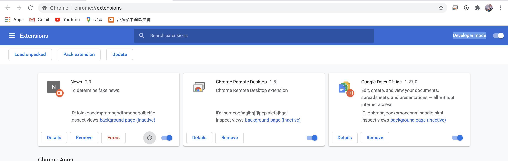
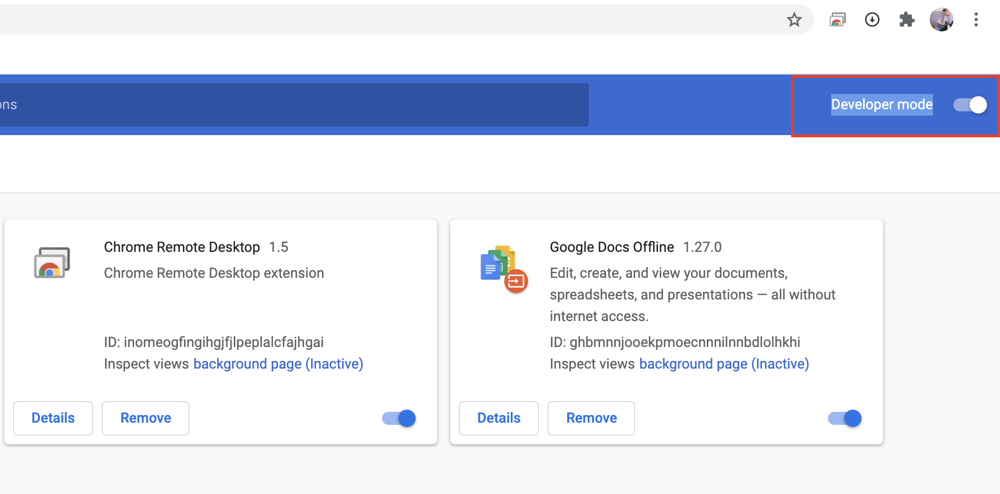
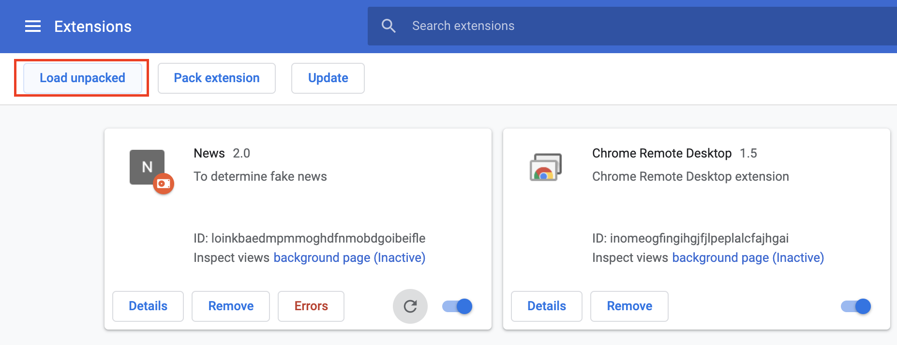
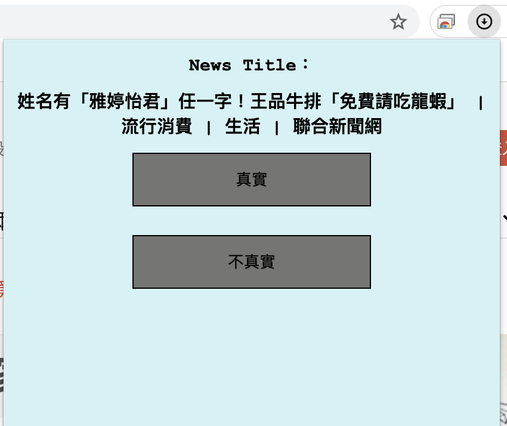

# fake-info-extension
The repo is a chrome extension for fake info system.
## Getting Started
### Prerequistes
* Google Chrome
### Usage
#### Open google chrome and search chrome://extensions to open plugin manager.
    
#### Turn-on developer mode.
    
#### Choose 'load unpacked' then open 'extension' folder in this repo.
    
    
#### Search any news in [聯合新聞網](https://udn.com/news/index).
#### Pin 'News' chrome extension and click it.
    
