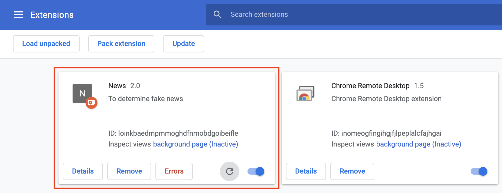

# fake-info-extension
The repo is a chrome extension for fake info system.
* [back end](https://github.com/NCKU-CCS/fake-info-backend)
## Getting Started
### Prerequisites
* Google Chrome
* npm 7.3.0
* eslint 7.26.0
### Usage
* Open google chrome and search chrome://extensions to open plugin manager.
  
* Turn-on developer mode.

  
* Choose 'load unpacked' then open 'extension' folder in this repo.

  
  
* Search any news in [聯合新聞網](https://udn.com/news/index).
* Pin 'News' chrome extension and click it.

  
### ESlint

* install npm
```
npm i -g eslint
```
* test .js file
This installs the ESLint CLI from the npm repository. To run ESLint, use the following format:
```
eslint [options] [file|dir|glob]*
```
such as:
```
eslint extension/<file name>.js
```
Please note that when passing a glob as a parameter, it will be expanded by your shell. The results of the expansion can vary depending on your shell, and its configuration. If you want to use node glob syntax, you have to quote your parameter (using double quotes if you need it to run in Windows), as follows:
```
eslint "extension/<file name>.js"
```
